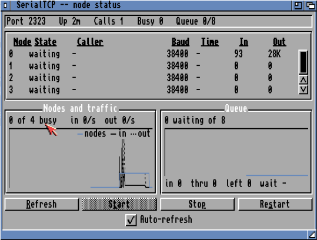

# SerialTCP

[](https://github.com/gheydon/serialtcp/actions/workflows/build.yml)
[](LICENSE)

A virtual serial device for AmigaOS that behaves like a Hayes modem but talks
TCP. Point BBS software such as DLG Professional at it and it can answer telnet
calls from the internet without knowing anything has changed.

| | |
|---|---|
| `serialtcp.device` | A `serial.device`-compatible Exec device with as many units as you configure. Goes in `DEVS:`. |
| `SerialTCPd` | The daemon that does the real work: sockets, telnet, AT commands, call routing. |
| `SerialTCPStatus` | Shell status and control. No MUI needed, so it works over a serial console and in scripts. |
| `SerialTCPStat` | The same thing as a MUI window, with history graphs and Start/Stop/Restart buttons. |
| `SerialTest` | A stand-in BBS node, for checking the device works without setting up a BBS. |

**One listening port serves every node.** A caller connects to port 23, and the
daemon hands them to whichever node is free. They never need to know which one.
Existing Amiga solutions bind each unit to its own separate TCP port, so callers
have to know which node they want.

**Unless you want that**, in which case `listen-node` gives one unit its own
private number while the rest keep pooling:

```
listen 23                # nodes 0-2, first free one answers
listen-node 2400 3       # node 3 has its own number
```

**When every node is busy, you choose what happens** — `when-busy` in the
config:

| | |
|---|---|
| `busy` | Send the busy message and hang up. What a real modem does; the default. |
| `queue` | Hold the caller until a node frees up, then put them through automatically, oldest first. |
| `ask` | Put it to the caller: wait, or call back later. |

**Any unit can be kept out of the incoming pool** with `outbound-only`. A node
listed there is never offered a call even when idle, so you can keep a unit for
dialling out from a terminal program without callers landing on the line you
are sitting on. Dialling out from it works exactly as normal.

Queued callers are told their position whenever it changes, and give up
gracefully after `queue-timeout`. Their type-ahead is preserved — while
waiting, their socket is only peeked at to notice a hangup, never read — so
anything they type before a node answers is still there when it does.

## Requirements

- AmigaOS 2.04 or later. Built for plain 68000, so anything from an A500 up.
- A TCP/IP stack providing `bsdsocket.library` — Roadshow, AmiTCP, Miami,
  Genesis, or AmiNetXDuo. Real hardware with an Ethernet card, or an emulator.
- `muimaster.library` for the status GUI only. Without it `SerialTCPStat`
  falls back to printing the same information to the shell.

## Building

The toolchain runs in Docker, so nothing needs installing on the host:

```bash
./build.sh
```

That produces `build/serialtcp.device`, `build/SerialTCPd` and
`build/SerialTCPStat`. To build without Docker, put bebbo's
`m68k-amigaos-gcc` on your PATH and run `make`.

To run the unit tests, which build natively on the host rather than
cross-compiling:

```bash
make test
```

## Installing

Copy all three together — they share a protocol version and refuse to talk to a
mismatched build rather than misbehaving.

```
copy build/serialtcp.device DEVS:
copy build/SerialTCPd       C:
copy build/SerialTCPStatus  C:
copy build/SerialTCPStat    C:
copy serialtcp.conf         S:
```

You do not have to copy the device into `DEVS:` if you would rather keep it
with the BBS — `DEVS:` takes a multi-assign:

```
Assign DEVS: DH1:SerialTCP ADD
```

Edit `S:serialtcp.conf` — at minimum set `nodes` to the number of BBS nodes you
run. Then start the daemon after your TCP stack is up:

```
SerialTCPd
```

It puts itself into the background and gives the shell straight back, so it is
safe to call from `S:User-Startup` without `Run`. Watch it with
`SerialTCPStatus`, and stop it from `SerialTCPStat` or by sending the process a
break.

If you would rather keep it in the shell — to watch the log scroll past while
you are setting it up, and stop it with Ctrl-C:

```
SerialTCPd NODETACH
```

A daemon started with `Run` is already in the background and is left alone.

## Pointing a BBS at it

Anywhere the BBS asks for a serial device, give it `serialtcp.device` and a
unit number, one unit per node. Node 1 gets unit 0, node 2 unit 1, and so on.

For DLG Professional specifically, see [docs/DLG-Pro.md](docs/DLG-Pro.md).

The BBS should be configured as if for a real modem: let it send its init
string, let it wait for `RING`, let it answer. All of that works. Carrier
detect works too, so when a caller drops the line the BBS logs them off exactly
as it would on a real modem.

## Checking on it

### From a shell — `SerialTCPStatus`

No MUI required, so this works over a serial console, through the BBS's own
shell, or in a script:

```bash
SerialTCPStatus                 # full report
SerialTCPStatus -b              # one line, for a title bar or a script
SerialTCPStatus -w 2            # live watch, refreshes until Ctrl-C
SerialTCPStatus start           # launch the daemon
SerialTCPStatus stop            # ask it to exit
SerialTCPStatus stop force      #   ... even with callers connected
SerialTCPStatus restart
SerialTCPStatus -q              # silent; the exit code says if it is running
```

Exit codes are meaningful, so it slots into a startup script: **0** running or
action succeeded, **5** not running, **10** failed, **20** bad arguments.

```
SerialTCPd  --  up 12m, 2 of 4 nodes busy  (1 dial-out only)
listening on 23     -> any free node
listening on 2400   -> node 3 only
calls 31, turned away busy 2

Node State     Caller               Baud   Time     In      Out
---- --------- -------------------- ------ -------- ------- -------
   0 ONLINE    203.0.113.44          38400 12:41    84K     1.2M
   1 waiting   -                     38400 -        0       0
   2 RINGING   198.51.100.9          38400 ring 2   0       0
   3 dial-out  -                     38400 -        0       0

Queue: 1 waiting of 8 places, 14 joined in total
       put through 11, hung up 2, timed out 1, declined 0
       wait 0:41 average, 3:12 longest
```

### As a window — `SerialTCPStat`



One row per node, two scrolling history graphs, and the queue figures. Needs
**MUI 3.8 or later** (`muimaster.library` 19+); without it the program prints
the text report instead of refusing to start.

`closed` means no BBS node has that unit open — usually that node just is not
running. A node in that state will never be given a call, and a unit reserved
to its own listener with `listen-node` shows as `dial-out`.

The node list scrolls when there are more nodes than fit, with the column
header staying put, and it is the part that grows when you resize the window.
The graphs hold two minutes of history at the one-second refresh and rescale
themselves if the node count or queue size changes.

The queue line accounts for everyone who joined: **in** (joined), **thru** (put
onto a node), **left** (hung up rather than wait), and the average wait for
those who got through. A high **left** count means your queue is longer than
callers are willing to sit through.

The window also has **Start**, **Stop** and **Restart**. Stop asks for
confirmation first if any node still has a caller on it, so a stray click
cannot cut people off; if you confirm, it forces the shutdown. Use
`-d <command>` if the daemon is not simply `SerialTCPd` on your path.

`SerialTCPStat -c` prints the same text report as `SerialTCPStatus`; both share
one implementation, so they cannot drift apart.

The window also has **Start**, **Stop** and **Restart** buttons. Stop asks for
confirmation first if any node still has a caller on it, so a stray click
cannot cut people off; if you confirm, it forces the shutdown. Use `-d
<command>` if the daemon is not simply `SerialTCPd` on your path.

## The queue-position joke

Off by default. If you want it:

```
queue-lie inflate     # starts higher than the truth and creeps upward
queue-lie random      # mostly honest, pads the number now and then
queue-lie off         # the default
```

`inflate` is the phone-tree classic — the longer someone waits, the worse their
position looks. Watched live on a caller who was genuinely first in line:

```
You are number 5 in the queue.
You are number 6 in the queue.
You are number 7 in the queue.
```

while the log recorded `queue: 127.0.0.1 waiting, position 1 (told 5)`.

**It is cosmetic only.** Callers are still served strictly in arrival order —
the lie cannot reorder the queue, delay anyone, or change who gets the next
free line, and the log always records the true position alongside what the
caller was told. Verified: a caller told they were number 7 was still served
first, ahead of one who arrived later.

## When something fails to open

`serialtcp.device` returns specific `io_Error` codes rather than a generic
open failure, and when it is opened from a Shell it also prints the reason:

| Code | Meaning |
|---|---|
| 101 | `SerialTCPd` is not running — start the daemon (and your TCP/IP stack) first |
| 102 | The device and the daemon are from different builds |
| 103 | Unit number is beyond the daemon's `nodes` setting |
| 1 | `SerErr_DevBusy` — the unit is already open exclusively |

Code 101 is by far the most common, and it is the reason the status client can
start the daemon for you.

## Supported AT commands

Enough for any BBS init string. `ATA` `ATD`/`ATDT`/`ATDP` `ATE` `ATH` `ATI`
`ATO` `ATQ` `ATV` `ATZ` `AT&C` `AT&D` `AT&F` `ATSn=v` `ATSn?` `A/`, plus
accept-and-ignore for the usual noise (`ATX`, `ATM`, `ATL`, `AT&K`, `AT\N`,
`AT%C` and friends) so a real-world init string returns `OK` instead of `ERROR`.

Dial out with `ATDT host:port`, e.g. `ATDT bbs.example.com:23`. `+++` escapes to
command mode with the usual guard timing, and `ATO` returns to data mode.

Result codes: `OK` `CONNECT` `CONNECT <baud>` `RING` `NO CARRIER` `ERROR`
`NO DIALTONE` `BUSY` `NO ANSWER`, in both verbose and numeric form.

## Memory

The point of the design is to stay small enough for real hardware:

| | |
|---|---|
| `serialtcp.device` | 2896 bytes (2412 with `-DST_MINIMAL`) |
| `SerialTCPd` | 31 KB |
| Runtime data, 4 nodes | ~19 KB |

All the logic lives in the daemon; the device is a shim that allocates units
and forwards IORequests. The only thing in it that is not strictly necessary is
the console error message on a failed open, which costs 484 bytes. To drop it:

```bash
./build.sh DEV_EXTRA=-DST_MINIMAL
```

The specific `io_Error` codes are present either way — only the human-readable
text goes.

Nothing is ever allocated from Chip RAM. Every allocation uses `MEMF_ANY`, so
on a machine with Fast RAM Exec satisfies all of it from Fast and leaves Chip
alone for the display.

Buffers are allocated for the number of nodes you configure, not the maximum,
so `nodes 2` really does cost half of `nodes 4`.

## Known limitations

- **DNS lookups block.** `bsdsocket.library` has no portable asynchronous
  resolver, so `ATDT somehostname` stalls every node until the lookup finishes.
  Dialling an IP address directly does not block. Inbound calls, which is what
  a BBS actually does, are unaffected.
- **No rate limiting.** The `answer-baud` figure is cosmetic; data moves as
  fast as the network allows regardless of what the BBS thinks the speed is.
- **The daemon must outlive the BBS.** If you kill `SerialTCPd` while a BBS has
  units open, pending requests are aborted and further ones fail cleanly rather
  than hanging — but the BBS will see errors. Stop the BBS first.

## Licence

GNU General Public License, version 2 or later. See [LICENSE](LICENSE).

## Building against DLG Professional

The scripts under `tests/host/` can build a complete AmigaOS 3.2 hard drive
with DLG Professional installed on four nodes, for testing. They need material
that is not in this repository because it is not mine to redistribute:

- **AmigaOS 3.2** -- the install floppies from the Hyperion CD.
- **DLG Professional** -- released as freeware with source by Jeff Grimmett,
  on Aminet under `comm/dlg/`. His terms allow private or public use on the
  Amiga provided it is not a commercial product.

Both are easy to obtain; see [docs/Testing.md](docs/Testing.md) for what the
scripts expect and where.

## Prior art

Worth knowing about before you use this:
[`telser.device`](http://aminet.net/comm/tcp/telser140.readme) (Sam Yee, 1996)
does much of the same job and has been in use for decades. It is closed source,
unmaintained since 1996, needs a keyfile for multiple units, and binds each unit
to its own TCP port rather than pooling calls across nodes.
[`telnetd.device`](http://megaburken.net/~patrik/telnetd.device/telnetd_device.guide)
(Christopher A. Wichura, 1993) is inbound-only and cannot dial out.
